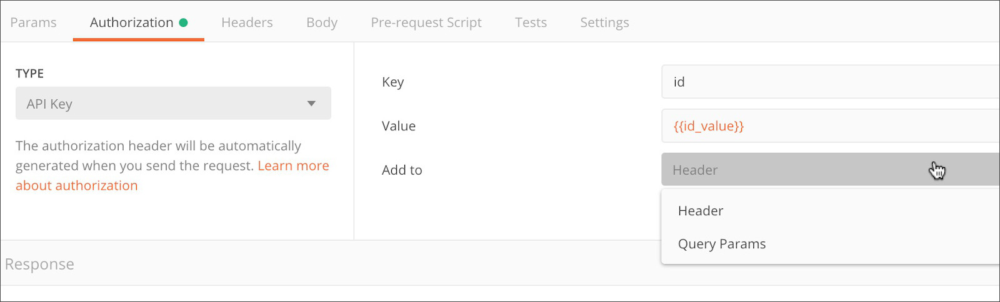

<br>
<div align="center">
  <h4 align="center">
     FutureSpace REST API
  </h4>
</div>

---

In here, you can see and test the REST API of rocket launches from FutureSpace Inc.


## 🚀 Getting started

Copy `.env-sample` to `.env` and fill the environment variables based your data to access the pg database and the API.

To clone and run the application, you will need to have [Git](https://git-scm.com), [Node.js](https://nodejs.org) + [Yarn](https://yarnpkg.com), [PostgreSQL](https://www.postgresql.org/download/) (with a pre created database named future-space) installed on your machine. With all programs installed, run the following command lines:

```bash
# Clone this repository
$ git clone https://github.com/nickcarva/future-space-rest-api.git

# Access the repository
$ cd future-space-rest-api

# Install the dependencies
$ yarn install

# Run all migrations
$ yarn typeorm migration:run

# Run application
$ yarn dev
```


## 🔑 API Key

So that you can access all the REST API endpoints, you must put an API key authorization header in the request. This API Key is registered in the `.env` file (just for a representation of security).
<br>
The header key is 'api-key'.

<p align="center">
  
</p>

